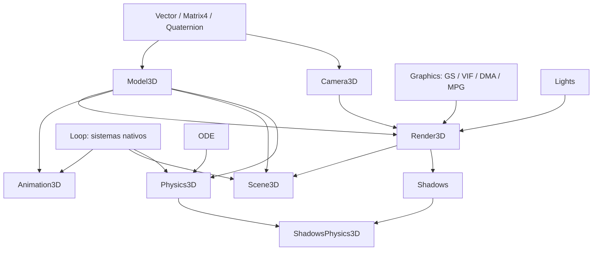

# Roadmap de migração do 3D para o AthenaENV modular

Análise do checkout em 03/10/2026. Este documento descreve o legado, a proposta de arquitetura e o estado da primeira implementação abaixo. Não foram executados builds, PCSX2 ou benchmarks do legado. As oportunidades de desempenho abaixo são hipóteses a validar por medição.

## 1. Diagnóstico

**Implementação iniciada:** o primeiro marco está documentado em
[docs/3D.md](../docs/3D.md), com APIs C/QuickJS de Quaternion, Camera3D,
Model3D e Render3D, exemplos e testes. É uma entrega parcial das fundações e
do renderer estático: os módulos são opcionais e o renderer é experimental.
O segundo incremento implementa recorte preciso nos seis planos em C para
instâncias que cruzam o frustum, preservando o caminho VU1 para as inteiramente
contidas. Inclui contadores de entrada/recorte/rejeição, buffers fixos e cenas
C/JS de diagnóstico. Texturas/luzes, animação, Scene3D e Physics3D continuam
pendentes. Não há
fachada compatível com a API antiga nem benchmark de ganhos nesta etapa.
Os exemplos nativo e QuickJS foram validados pelo usuário em PCSX2, com os
cubos aparecendo corretamente. A validação encontrou e corrigiu uma falha
na leitura de operandos desalinhados do QuickJS para R5900; detalhes e
regressões estão em `docs/3D.md`. O shader e as cenas do novo recorte ainda
precisam de validação visual no alvo; testes host não emulam a execução VU1.

O legado tem um backend 3D substancial em C e microprogramas VU1. O trabalho principal é preservar esse backend enquanto se corrigem contratos de memória, atualização e dependências, seguindo `NEW_MODULE_DIRECTIVES.md`. A migração deve aproveitar a infraestrutura atual de gráficos, matemática, jobs e sistemas do `Loop`.

Na análise inicial não existiam manifestos para renderer 3D, câmera 3D, iluminação, animação esquelética, ODE ou sombras. Agora há manifestos opcionais de `quaternion`, `camera3d`, `model3d` e `render3d`. `Vector` e `Matrix4` já estavam migrados. `Camera2D`, `Collision` e `Box2D` são 2D; `Scene` gerencia telas, transições e assets em JavaScript e não substitui uma hierarquia espacial 3D.

Recomendação: começar por uma cena estática com câmera, iluminação e HUD 2D; depois integrar cena nativa, animação, consultas espaciais, física e sombras. Otimizações adicionais devem entrar depois de uma referência funcional reproduzível, mantendo as proteções necessárias ao DMA desde o primeiro renderer.

## 2. Inventário do legado

Os nomes nesta tabela são os módulos/imports e componentes encontrados, não necessariamente unidades de build independentes.

| Módulo/componente | Finalidade e comportamento encontrado | Fontes principais em `old/` | Destino recomendado |
|---|---|---|---|
| `Render` | Inicialização e início de passe; projeção; seleção de pipelines sem luz, difuso e especular; clipping, face culling, frustum culling e estatísticas. Backend inclui passes de decal, reflexão e bump. | `src/js_api/ath_render.c`, `src/render.c`, `src/calc_3d.c` | `render3d`, reutilizando `graphics` |
| `RenderData` | Geometria e recursos compartilháveis: posições, normais, UVs, cores, materiais, texturas, bounds, esqueleto e pesos. Loaders de OBJ/OBJF e glTF/GLB, buffers compartilhados opcionais, clones, caches compactos e `freeze()`. | `src/js_api/ath_render.c`, `src/mesh_loaders.c`, `src/athena/render_facade.c` | `model3d`, com caches de submissão privados em `render3d` |
| `RenderObject` | Instância de uma geometria: posição, rotação, escala, matriz, pose esquelética, controlador de animação e vínculo com colisão/corpo físico. Desenha objeto e bounds. | `src/js_api/ath_render.c`, `src/render.c`, `src/athena/render_facade.c` | Instância em `model3d`; desenho em `render3d`; animação/física nos respectivos módulos |
| `RenderBatch` / `Batch` | Mantém lista de objetos, ordena e chama o renderer em C, reduzindo chamadas JS por objeto. | `src/render_batch.c`, binding dentro de `src/js_api/ath_render.c` | `Render3D.Batch` dentro de `render3d` |
| `RenderSceneNode` / `SceneNode` | Hierarquia pai/filho, TRS local, composição de matrizes mundiais e objetos anexados; atualiza geometria de colisão anexada. | `src/render_scene.c`, binding dentro de `src/js_api/ath_render.c` | `scene3d` |
| `RenderAsyncLoader` / `AsyncLoader` | Fila cooperativa: `process(budget)` executa até N carregamentos completos na thread chamadora. O orçamento é em jobs, não em tempo; um modelo grande pode bloquear um frame. | `src/render_async_loader.c`, binding dentro de `src/js_api/ath_render.c` | Jobs de modelos dentro de `model3d`, usando `thread` |
| `Camera` 3D | Estado global de posição, alvo e up; orbit, turn, pan, dolly, zoom, save/restore e construção de matrizes de visão. | `src/js_api/ath_3dcamera.c`, `src/camera.c`, `src/athena/camera3d.c` | `camera3d` / `Camera3D`, com instâncias |
| `Lights` | Até quatro luzes direcionais; atributos direção, ambiente, difuso e especular; envio de constantes ao VU1. | `src/js_api/ath_lights.c`, `src/athena/lights.c`, implementação em `src/render.c` | `lights`: estado em C; upload pelo renderer |
| `AnimCollection` + skinning | Carrega clips glTF, busca por nome/índice, interpolação de keyframes, quaternion slerp, hierarquia de ossos, inverse bind e paleta por instância; programas VU1 deformam vértices. | `src/js_api/ath_anim_3d.c`, `src/athena/anim3d.c`, `src/skin_math.c`, `src/mesh_loaders.c` | `animation3d`, reutilizando tipos de `model3d` |
| `ODE` | Worlds, spaces, bodies, geometrias, raycasts, massas, forças, joints e contatos. Inclui criação de trimesh a partir de `RenderObject` e stepping com contatos. | `src/js_api/ath_ode.c`, `src/athena/ode_facade.c`, `ee_modules/ode/` | `ode` como motor independente; `physics3d` como integração de jogo |
| `Shadows.Projector` | Sombra projetada por textura sobre uma grade; configura tamanho, subdivisão, direção, bias, UV e blend; pode deformar a grade via raycasts ODE. | `src/js_api/ath_shadows.c`, `src/shadows.c`, `src/athena/shadows_facade.c` | `shadows`, com adaptador físico opcional |
| Vetores e matrizes | Matemática usada pelo renderer, câmera, cena e esqueleto; há funções em C e assembly/VU0. | `src/vector.c`, `src/matrix.c`, `src/js_api/ath_vector*.c`, `src/js_api/ath_matrix.c` | Estender `vector` e `matrix4` atuais; adicionar quaternion |
| Backend VU1/VIF/DMA | Microprogramas de cores, luzes, especular, versões com skinning e reflexão; layouts de memória, clipping e compactação de atributos. | `src/vu1/draw_3D_*.vcl/.vsm`, `src/vu1/include/`, `src/vu1/proc/`, `src/render.c` | `render3d/vu1/`; transporte compartilhado em `graphics` |

Bibliotecas associadas: `fast_obj` e `cgltf` para importação; ODE usa também OPCODE/Ice. A extensão OBJF aparece no dispatch do loader; seu contrato e as alterações locais de `fast_obj` precisam ser documentados antes do porte.

**Cuidado com o nome Camera:** `old/src/js_api/ath_camera.c` é câmera USB/dispositivo. A câmera de uma cena 3D está em `ath_3dcamera.c`. Usar `Camera3D` evita confusão com esse serviço e com `Camera2D`.

Exemplos úteis para referência: `old/bin/render.js`, `old/bin/skinning.js` e `old/bin/shadows.js`. Devem virar cenas mínimas de regressão, com dependências e assets explícitos.

## 3. O padrão atual a seguir

Referências: `portingDocs/NEW_MODULE_DIRECTIVES.md`, `tools/modules.js`, `src/core/include/athena/module.h` e manifestos de `sprite`, `camera2d`, `tilemap`, `thread` e `box2d`.

```text
src/modules/<id>/
  module.json
  include/athena/<id>.h      contrato C, independente do QuickJS
  include/athena/js/<id>.h   apenas quando outro binding precisa do adaptador
  native/                   estado, algoritmos e gestão de recursos
  quickjs/ath_<id>.c/.h      validação, conversão, erros e exports
  vu1/                      quando houver microprogramas
  <id>.d.ts
```

- `sources` compila em `RUNTIME=quickjs` e `RUNTIME=native`; `quickjs.sources` somente no runtime JS. Lógica de animação, colisão, carregamento e cena pertence ao código nativo.
- `dependencies.modules` declara toda dependência efetiva; apenas os headers dos módulos selecionados ficam disponíveis. Definir builds pequenos para provar essa separação.
- Hooks `native.init/shutdown/quiesce` e `quickjs.cleanup_func` têm escopos diferentes. Registro QuickJS cria a API; inicialização de hardware e drenagem de trabalho usam os hooks adequados.
- Objetos usam classes opacas, `JS_GetOpaque2`, finalizers e destruição explícita idempotente. Usar `athena_register_class()` em cada runtime e restaurar protótipos em cada contexto.
- Referências nativas precisam de um contrato próprio de retain/release ou invalidação; manter um wrapper JS vivo não torna seguro seu `.free()` enquanto outra instância o usa. Referências JS armazenadas em C precisam da integração apropriada com o GC, inclusive `gc_mark` quando aplicável.
- Um manifesto descreve um nome de módulo QuickJS. O legado registra seis nomes dentro de `athena_render_init()`. Preferir exports de classes em namespaces atuais e fachadas de compatibilidade com manifestos próprios, em vez de registro escondido no renderer.
- `.vsm` entra em `sources`, como em `tilemap/module.json`. O Makefile atual regenera `.vsm` a partir de `.vcl` adjacente com OpenVCL. Preservar includes auxiliares, símbolos e dependências de rebuild desses includes.
- Registros, Makefile de módulos, catálogo e typings agregados são gerados por `tools/modules.js`; não editá-los manualmente. Conferir suporte da tabela de exports antes de usar novos tipos de entrada.

O padrão 2D oferece exemplos concretos de redução de JS: `Sprite` avança animações em C e desenha lotes; `Collision` executa movimento e consultas em C; `Camera2D` calcula seguimento e efeitos; `TileMap` envia lotes ao VU1. `Scene`, `Ease` e `Tween` têm implementação JS: a arquitetura atual admite orquestração em JS quando faz sentido.

## 4. Contratos a resolver antes da cópia do backend

Esta tabela registra os achados da análise inicial. O estado das correções
implementadas está na seção 7.1; os riscos dos componentes ainda não migrados
continuam orientando os próximos portes.

| Achado no código | Implicação para a migração |
|---|---|
| `ath_anim_3d.c` devolve ponteiros de clips com `JS_NewUint32`, e seu setter copia dados de um endereço recebido como número. `ath_render.c` recebe o número em `playAnim`. | Substituir por `AnimationClip` opaco, mantendo sua coleção proprietária viva. Remover setters que aceitam endereços arbitrários. |
| `render_object()` chama sincronização física e avaliação de esqueleto; `process_animation()` usa `clock()`. | Separar update de draw. Pausa, timeScale, fixed step, dois passes/câmeras e objetos sem draw precisam ter comportamento definido. A atualização física ali é sincronização do objeto, não o solver ODE. |
| `render_batch.c` ordena por pipeline e pelo índice local da primeira textura do material. Depois chama `render_object` uma vez por item e retorna o tamanho da lista. | Índice local não identifica a textura compartilhada entre meshes. Criar chave por recurso/material/pass real; separar opacos e transparentes. Diferenciar objetos submetidos, rejeitados e passes emitidos nas estatísticas. Batch antigo não é instancing por hardware. |
| `render_scene.c` só impede parent == child e destrói descendentes recursivamente. O binding mantém referências pai/filho. | Rejeitar ciclos entre ancestrais; definir ownership e desligamento dos wrappers; corrigir propagação e destruição antes de reutilizar o grafo. Acrescentar dirty flags. |
| `render_scene.c` extrai translação de world[3], [7], [11]; `Matrix4` atual escreve translação em [12], [13], [14]. Skinning possui transposes próprios. | Há convenções distintas a reconciliar. Criar testes numéricos de TRS, composição pai/filho, lookAt, projeção, glTF e inverse bind antes de trocar funções. Não remover transposes por aparência. |
| `AthenaRenderData` tem clones com índices, skin e skeleton compartilhados, mas o destrutor da facade libera esses campos sem ownership separado. | Redesenhar recursos compartilhados e destruição; não transportar essa facade como contrato definitivo. Clones compartilhados e profundos devem ser explícitos. |
| `shareBuffers`, compactação e `freeze()` coexistem. `freeze()` remove os atributos float usados por trimesh ODE e pela grade de sombras. | Definir edição com commit/invalidação e retenção do buffer, alinhamento e bounds; cozinhar colisão antes de freeze ou manter recurso de colisão separado. Não prometer zero-copy em todas as etapas do backend. |
| `render.c` chama `owl_flush_generation`, `owl_generation_read` e `owl_wait_generation`, ausentes no transporte atual na análise inicial. | O primeiro incremento acrescentou tickets de geração em `graphics`; chains cacheadas ainda exigem contrato de lifetime dos buffers referenciados. Eles não podem ser alterados ou liberados enquanto pendentes. |
| `tilemap.c` atual já usa `vu1_invalidate_static_data()`. 2D e 3D têm layouts BASE/OFFSET diferentes. | Usar versionamento compartilhado de constantes e restaurar layout, câmera, luzes e estado GS em cada troca de passe. Testar sequências 3D → 2D → 3D no mesmo frame. |
| Paleta VU1 começa no QW 880; o layout reserva 128 QW para 32 ossos, seguido de stack. Pesos têm quatro influências por vértice. | Tratar 32 ossos por paleta do layout legado como limite validado, não permitir overflow. Modelos maiores exigem particionamento offline e remapeamento de joints por segmento. |
| `loadOBJ` usa o resultado de `fast_obj_read` sem validar NULL; loader de animação acessa `skins[0]`; loadModel tem retorno void. | Criar resultados de erro explícitos, rollback de alocações e validação de formatos/limites. glTF sem skin e arquivos malformados precisam de comportamento definido. |
| `Lights` tem quatro slots, mas `SetLightAttribute` só rejeita id negativo. | Validar limite superior e enums; separar alteração de estado do envio imediato de pacotes. |
| `stepWithContacts` ODE já detecta/resolve contatos nativamente, mas cria objetos e arrays JS por contato no binding e pode chamar JS durante o callback de colisão. | Mover o pipeline completo para a API C e oferecer eventos agregados opcionais, sem alocações JS por contato quando ninguém os consome. |

## 5. Arquitetura proposta

Os nomes abaixo são propostas. Manter classes familiares em fachadas opcionais pode facilitar a migração dos jogos.

| ID / import | Responsabilidade | Dependências principais propostas |
|---|---|---|
| `model3d` / `Model3D` | Mesh, materiais, esqueleto, pose/instância e bounds; importação e jobs de assets; retain/release. Sem submissão ao GS. | `vector`, `matrix4`, `image`, `thread`; `quaternion` quando incorporado |
| `camera3d` / `Camera3D` | Câmeras independentes, view/projection, frustum e conversões mundo/tela. | `vector`, `matrix4` |
| `lights` / `Lights` | Conjuntos de luzes e dirty flags; sem escrever no VU1 diretamente. | `vector` |
| `render3d` / `Render3D` | Passes, filas, Batch, culling, caches de submissão, microprogramas e estatísticas. Consome instâncias e câmera sem atualizá-las. | `graphics`, `image`, `model3d`, `camera3d`, `lights` |
| `scene3d` / `Scene3D` | Grafo de transforms, dirty propagation, coleta de objetos e integração com as fases do Loop. | `model3d`, `render3d`, `loop` |
| `animation3d` / `Animation3D` | Clips e controllers, avaliação de pose, sockets, pausa, velocidade e eventos; sistema nativo opcionalmente ativado no Loop. | `model3d`, `quaternion`, `loop` |
| `ode` / `ODE` | World/body/geom/joints, consultas e solver, sem dependência de renderer ou wrappers de render. | Bibliotecas/fontes ODE e suas dependências nativas |
| `physics3d` / `Physics3D` | Materiais de contato, fixed stepping, eventos agregados e vínculos body → instância/transform; criação de collider a partir de mesh. | `ode`, `model3d`, `loop` |
| `shadows` / `Shadows` | Projetores, geometria de grade e submissão dos passes. Interface C para consultar receptores. | `render3d`, `model3d`, `image` |
| `shadowsphysics3d` / `ShadowsPhysics3D` | Adaptador de consultas ODE para o projetor, quando necessário. | `shadows`, `physics3d` |

Não criar um módulo para cada arquivo C. Batch e materiais podem permanecer partes dos módulos acima. O adaptador de sombras só merece módulo separado se for necessário selecioná-lo no build; a separação da interface já deve existir desde o início.



As setas significam “base usada por”. O renderer nunca depende de ODE, `Scene3D` ou `Animation3D`: ele recebe transforms e poses já preparados. O modelo define os dados neutros; animação escreve a pose e renderização a consome. Essa direção evita dependências cíclicas.

`Scene.Assets.define()` atual permite registrar loaders de mesh/clip; usá-lo para integrar assets 3D às telas do jogo, sem substituir o módulo `Scene`. A composição espacial pertence a `Scene3D` em C.

## 6. Como reduzir trabalho JavaScript

Priorizar operações que atravessam muitos objetos, ossos, contatos ou vértices. Converter uma única operação simples para C, mantendo milhares de chamadas ao binding por frame, pode preservar o gargalo.

| Área | Trabalho nativo proposto | Trabalho que permanece no JS |
|---|---|---|
| Cena | Atualizar transforms sujos, bounds e lista visível; coletar e ordenar render queues. | Criar entidades, anexar recursos e tomar decisões de gameplay. |
| Animação | Interpolar clips, compor ossos, gerar paletas e atualizar sockets uma vez por update/pose. | Escolher clip, velocidade, transição e tratar eventos selecionados. |
| Física | Broad/narrow phase ODE, criação de contatos, solver e sincronização em lote. | Aplicar comandos e consumir begin/end de contato ou triggers em lote. |
| Câmera | Follow/orbit, suavização, limites, colisão com cenário e cálculo de matrizes. | Definir alvo e parâmetros do comportamento. |
| Carregamento | Ler, validar, decodificar e preparar dados CPU em jobs, com cancelamento. Publicar recursos gráficos na thread principal. | Descrever assets e tratar conclusão/erro. |
| Geometria | Gerar primitivas, normals/bounds e commit de buffers em lote. | Escolher parâmetros e alterações pontuais. |
| Desenho repetido | Enviar uma coleção com transforms em buffer e ordenar por recursos reais. | Fazer uma chamada por coleção/passe. |

Fluxo sugerido, respeitando prioridades dentro das fases existentes:

1. `PRE_UPDATE`: coletar resultados de jobs e publicar recursos prontos com orçamento.
2. `UPDATE(step)`: aplicar comandos físicos e executar simulação a passo fixo. O Loop atual chama sistemas UPDATE antes do update da aplicação; comandos podem ser enfileirados para o próximo passo. Para controle que exige o mesmo passo, ajustar explicitamente a integração, sem assumir uma fase pós-update fixa inexistente.
3. `POST_UPDATE(dt)`: sincronizar corpos e transforms, avaliar animações conforme sua política temporal, propagar hierarquia e preparar câmera. Se houver interpolação física para desenho, fazê-la antes da coleta no `PRE_DRAW` usando alpha.
4. `PRE_DRAW(alpha)`: preparar bounds/filas da cena, passe e estado do renderer; a aplicação chama o draw da cena ou ativa desenho automático explicitamente.
5. `POST_DRAW(alpha)`: fechar passes, restaurar estado e drenar eventos/liberações somente quando o contrato de DMA permitir.

O jogo C também pode dirigir os mesmos sistemas ou APIs manualmente. A API C não deve exigir um `JSContext` para obter esses benefícios.

## 7. Roadmap por entregas

Estimativa relativa: S = pequena, M = média, G = grande, GG = muito grande. A previsão de calendário depende de equipe, hardware e benchmarks da fase 0.

| Fase | Entrega | Pré-requisitos | Porte | Critério de aceite |
|---|---|---|---|---|
| 0 | Contratos e referência: formatos, convenções matemáticas, ownership, cenas pequenas e métricas do legado. | Checkout antigo e ambiente PS2 | M | Casos de referência reproduzíveis; lista de incompatibilidades; baseline registrado quando executado. |
| 1 | Fundação: testes de Matrix4/TRS/glTF; Quaternion; lifetime DMA e estado VU1 compartilhado em graphics. | 0 | G | Composição numérica correta; nenhum buffer pendente é sobrescrito/liberado; 2D continua funcional. |
| 2 | Corte vertical estático: Model3D síncrono mínimo, Camera3D, Lights, Render3D sem luz e difuso, Batch simples. | 1 | GG | Triângulo/cubo, OBJ e GLB mínimos; depth e face/frustum culling; cena 3D com HUD; builds C e JS e seleção mínima. |
| 3 | Cena e recursos: Scene3D com dirty flags, filas opacas/transparentes, identidade real de materiais, edição/commit, clones e caches compactos/chains. | 2 | G | Pais/filhos corretos, ciclos rejeitados, recursos compartilhados liberados uma vez; benchmark de muitos objetos; trocas de passe seguras. |
| 4 | Animation3D e skinning VU1; Loop/timeScale; clips opacos, sockets e limites de paleta. | 3 | G | Duas instâncias com mesmo mesh e clips diferentes; pausa; objetos ocultos; dois draws no frame sem avanço duplo; limites de ossos e pesos validados. |
| 5 | Carregamento por jobs e integração Scene.Assets; cache de assets e orçamento de publicação. | 3; clips após 4 | G | Progresso/cancelamento/erro; UI continua avançando; recursos GS publicados na thread principal; teardown sem worker usando estado morto. |
| 6 | ODE desacoplado e Physics3D: shapes, trimesh, raycast, fixed stepping, eventos e sync em lote. | 3 e contrato de collision mesh | GG | Mundo físico funciona sem renderer; corpos continuam simulando sem draw; massas/joints/contatos e remoção de vínculos corretos. |
| 7 | Shadows e passes restantes: especular, decal, reflexão e bump; adaptador opcional de raycast. | 4 e 6 para sombras sobre colisores | G | Estado GS restaurado, cenas 2D/3D alternadas, sombras em plano e geometria, custo por passe medido. |
| 8 | Otimizações avançadas e módulos de gameplay selecionados por medição. | MVP funcional e perfis anteriores | Variável | Ganho demonstrado em tempo de frame, chamadas JS/nativo e memória, com regressões controladas. |

Fases 4, 5 e 6 compartilham a base da fase 3 e podem ser planejadas como trilhas independentes. O primeiro jogo explorável pode usar somente 0–3 e colisão simples; não precisa esperar todos os joints de ODE ou todos os efeitos visuais.

**Primeiro marco recomendado:** carregar um GLB estático, compartilhar o mesh entre várias instâncias, renderizar com uma câmera e luz direcional, desenhar HUD 2D e liberar/recarregar a cena com segurança. Ainda sem animação ou física. Esse marco exercita o novo padrão inteiro com um escopo revisável.

### 7.1. Progresso registrado em 03/10/2026

As fases acima continuam sendo o plano completo. Os incrementos entregues
estabelecem a base e parte da fase 2; não encerram o corte vertical com luzes e HUD.

| Fase / frente | Estado | Entregue | Falta para concluir |
| --- | --- | --- | --- |
| 0 — contratos e referência | Parcial | Inventário do legado; riscos de ownership/API; convenções matemáticas e limites; demos C/JS dos cubos. | Baseline de tempo/memória do legado e matriz de compatibilidade por export; mais cenas com assets reais. |
| 1 — matemática e transporte | Parcial | Quaternion nativo; composição Matrix4 A × B corrigida; TRS; cópias de matrizes; retain/release; tickets de geração DMA e espera antes de reutilizar o ring. | Comprovação no PS2 real; sequências 3D → 2D → 3D, câmera/pass switches e teardown/reload no alvo. |
| 2 — geometria e câmera | Parcial | Model3D com malhas copiadas/imutáveis e instâncias independentes; Camera3D com dirty flags; loaders síncronos OBJ/glTF/GLB de cor; limites e erros explícitos. | Normais, UVs, materiais/texturas e iluminação; orçamento completo de parsing e validação visual dos loaders no alvo. |
| 2 — renderer e recorte | Implementado; validação visual pendente para o recorte | Passe opaco unlit VU1, Batch nativo, AABB culling, depth reverso, restauração TEST/ZBUF; recorte nos seis planos em C e caminho VU1 para objetos contidos; estatísticas e demos de recorte. | Confirmar imagem, depth e winding; adicionar HUD; medir custos CPU/DMA; migrar passe difuso. |
| Integração modular | Entregue para os quatro módulos atuais | Manifestos opcionais, headers C, bindings finos, `.d.ts` e geração de catálogo/registries; builds mínimos native/QuickJS com 11 módulos resolvidos. | Repetir esse critério para cada novo módulo; manter os módulos avançados fora da dependência mínima. |
| 3–8 | Planejado | Direção de dependências e critérios de aceite definidos neste documento. | Scene3D, edição/caches, animação/skinning, jobs, física, sombras e otimizações guiadas por perfis. |

Validação executada neste incremento: suíte host completa com UBSan, testes
3D/pacotes de 32 bits com ASan/UBSan e suíte QuickJS de 32 bits sem falhas.
O recorte foi exercitado com 20 mil triângulos determinísticos, seis planos,
interpolação de cores, orientação e expansão de pacotes. Os três microprogramas
OpenVCL correspondem aos `.vsm` versionados. Builds EE dos exemplos QuickJS,
nativo dos cubos e nativo de recorte concluídos. A regressão dos módulos 3D
passou com 59 verificações e a de arrays com 202, ambas repetidas em dois
runtimes novos no mesmo processo.

A seleção original de 36 módulos foi restaurada e o build QuickJS de regressão
concluiu como `bin/athena_regression.elf`. Os ELFs 3D usam a seleção mínima,
independentemente dessa configuração restaurada. O build completo ainda emite
avisos de compilação do QuickJS e de ABI/float mode do objeto legado libmpeg;
sucesso de linkedição não elimina a necessidade de investigar esses avisos
na frente de manutenção das dependências.

O usuário confirmou os cubos C e JS em PCSX2 **antes do novo incremento de
recorte**. Isso comprova a correção do problema de arrays no exemplo JS,
mas não valida visualmente o shader modificado, a nova cena de recorte nem
a sincronização no PS2 real. Não há comparação de desempenho medida.

### 7.2. Descobertas e decisões decorrentes

| Descoberta | Evidência e alcance | Correção / decisão |
| --- | --- | --- |
| Arrays JS com 36 índices chegavam ao binding com comprimento 32; uma inspeção adicional causou TLB Miss e assertion em JS_FreeAtomStruct. | Logs do usuário em PCSX2; endereços mapeados no ELF para o caminho de átomos/bytecode; cubos nativos funcionavam. | `get_u32()` no PS2 lê bytes voláteis e preserva operandos desalinhados, evitando recombinação em LWL/LWR. Assembly conferida e cubos JS confirmados pelo usuário. A interação exata entre toolchain e word-merge do R5900 ainda requer caso mínimo independente. Regressões: `array_literal_test.js` e `quickjs_operand_test.c`. |
| O GCC R5900 eliminava verificações `isfinite(float)`. | Inspeção da assembly do build; buffers TypedArray podem conter padrões IEEE NaN/Inf mesmo quando o compilador assume aritmética finita. | Helper `athena/float_bits.h` inspeciona bits IEEE; proteção aplicada a geometria, câmera, quaternions, recorte e conversões JS/Matrix4. Testes cobrem padrões não finitos e preservação de estado em falhas. Não equivale a uma auditoria de todos os módulos do projeto. |
| Matrix4.multiply calculava B × A enquanto o contrato publicava A × B. | Inspeção do caminho VU0 e testes com matrizes não comutativas. | Corrigida a ordem e documentada a incompatibilidade para jogos que compensavam a inversão. Convenção única: column-major, vetores coluna e TRS explícito. |
| Descartar todo triângulo que cruza o frustum não preserva a parte visível. | Comportamento do microprograma inicial e testes numéricos de interseções, inclusive vértice atrás da câmera. | Recorte homogêneo antes da divisão por W, com cor interpolada e fan triangulation em C; VU1 preservado para objetos inteiramente contidos. Imagem do novo caminho ainda precisa de confirmação no alvo. |
| O recorte pode ampliar o número de triângulos e o volume DMA. | Teste de 18 triângulos parcialmente visíveis produz 36 triângulos e três chunks; verificação de UNPACK xyzw e RGBA8. | Buffers fixos e chunks limitados a 48 vértices; cópia para o ring antes da reutilização; contadores sourceTriangles/clippedTriangles/rejectedTriangles. `triangles` passa a contar a saída enviada ao VU1, não pixels/triângulos rasterizados. |
| Precisão double reduz instabilidade nas interseções, mas custa software no EE. | Escolha de implementação; custo ainda não medido em cenas reais. | Restringir o caminho CPU às AABBs que cruzam o frustum. Medir malhas grandes, subdivisão espacial e alternativa VU1 antes de anunciar ganho de performance. |
| Lifetime JS, leitura DMA e rasterização GS são eventos diferentes. | Testes do renderer/transporte verificam troca de canais, reutilização do ring e dados válidos após liberar a malha. | Retenção nativa explícita e geometria copiada. Tickets cobrem leitura DMA; não representam conclusão do GS. DMA_REF/chains cacheadas permanecem adiados até haver lifetime e medição adequados. |
| As dependências e ferramentas efetivas podem ser conferidas dentro da imagem de build. | Builds pelo Docker no WSL com PS2SDK/OpenVCL; testes host de 32 bits em imagem própria. | Usar o shell da imagem para consultar headers/fontes de ps2dev, ps2sdk, OpenVCL e demais dependências; comandos e caminhos em [BUILDING_ATHENA.md](../docs/BUILDING_ATHENA.md#wsl-com-docker-e-inspecao-do-toolchain). Docker/WSL é o caminho disponível quando Podman não sustenta o build. |

### 7.3. Próximos passos, na ordem de execução

1. **Fechar a validação do recorte no alvo.** Executar os cubos atualizados e
   `athena_3d_clip_native.elf`; no QuickJS, usar
   `athena_3d_js.elf --cfg=3d_clip.ini`. Confirmar preservação da parte visível
   nas quatro bordas e no plano próximo, cores contínuas, ausência de erros
   e coerência dos contadores. Repetir no PS2 real quando disponível.
2. **Consolidar regressões gráficas e baseline.** Acrescentar cenas de depth,
   CULL_BACK/CULL_FRONT, dois passes/câmeras, HUD 2D e teardown/reload.
   Registrar tempo CPU, volume DMA, memória e custo de objetos contidos versus
   malhas cruzando o frustum. Aceite: imagem correta e comparação reproduzível,
   sem anunciar ganho percentual antes da medição.
3. **Completar o corte estático da fase 2.** Definir materiais por descriptor,
   normais/UVs e recursos de textura com retenção; implementar Lights com
   instâncias, limites e dirty flags, e migrar o passe difuso. Usar um GLB
   pequeno compartilhado por instâncias e HUD como cena de aceite C/JS.
4. **Iniciar Scene3D (fase 3).** Grafo nativo com ciclos rejeitados, transforms
   sujos e bounds/filas em lote; integração explícita com Loop, sem atualização
   implícita em draw. Medir muitos objetos antes de introduzir caches DMA_REF.
5. **Avançar pelas trilhas posteriores.** Animation3D com clips opacos e pose
   por instância; jobs de assets com orçamento/cancelamento; ODE desacoplado e
   Physics3D com sync/eventos em lote. Sombras e efeitos dependem dessas bases.

Os passos 1–2 são os próximos critérios de aceite. O recorte já implementado
não deve ser confundido com a conclusão da fase 2 ou com desempenho comprovado.

## 8. Novos módulos e extensões úteis

| Proposta | Finalidade / JS eliminado | Prioridade e dependências |
|---|---|---|
| `Quaternion` | Normalização, composição, slerp e conversão TRS em C, sem expressar rotações de ossos em loops JS. | P0; base implementada no primeiro incremento. Integração com ossos depende de Animation3D. |
| Extensão de `Matrix4` / `Vector` | TRS quaternion/Euler, lookAt, projection e transforms em lote com buffers; APIs de saída reutilizável. | P0; evita duplicar uma segunda biblioteca matemática. |
| `Collision3D` | Consultas leves de AABB/esfera/cápsula, raycasts e índice espacial de meshes estáticas; alternativa selecionável para jogos que não precisam de rigid-body solver. | P1 após MVP. Estimar custo de manter backend próprio; não duplicar ODE sem ganho comprovado. |
| `Character3D` | Cápsula cinemática, sweep-and-slide, chão, degrau, inclinação e salto. Evita integrar gravidade e resolver paredes em JS. | P1, depende de um contrato de consultas/sweeps implementado por Collision3D ou backend físico. Não assumir sweeps contínuos já disponíveis no ODE legado. |
| Controllers de `Camera3D` | Follow, órbita, suavização, tremor e obstrução. Substitui cálculos por frame em JS. | P1; follow/orbit sem física, obstrução por adaptador de consultas. |
| `Geometry3D` | Primitivas e preparação de normals, tangents, bounds e collision meshes em C. | P1, `model3d`; processamento offline preferível para assets fixos. |
| `Particles3D` | Emissão, pools, integração, billboards e desenho em lotes; reutiliza math/random e transporte gráfico. | P2; medir ordenação de transparência e fill-rate, além do custo EE. |
| Coleções de instâncias e LOD em `Render3D`/`Scene3D` | Transform buffers, culling/seleção de LOD e submissão em lote; reduz chamadas por objeto. | P1 para coleções, P2 para LOD. Instancing é uma API de lote, com execução real a medir no backend. |
| `Terrain3D` | Heightfield por chunks, consultas de altura, bounds e LOD; geração de dados a partir de Noise. | P2, para jogos que precisam de terreno. Reutilizar `Noise` atual. |
| `Navigation3D` | Paths sobre navmesh e atualização de agentes em lote. | P3, condicionado a jogos com vários agentes e perfil de custo. |
| `Debug3D` | Linhas/bounds/frustum/ossos/contatos em lotes e visualização de métricas; extensão do Debug atual. | P1, ferramenta da própria migração; adaptadores físicos opcionais. |
| Ferramenta de assets offline | Converter modelos para formato versionado com geometria compacta, segmentos por paleta, materiais e colisão preparados; reduz parse, conversão e pico de memória no console. | P1/P2; ferramenta de build em `tools/`, não módulo runtime obrigatório. |

Priorizar Quaternion, Scene3D, Animation3D, controllers de câmera, integração física e coleções antes de um ECS genérico. Um ECS completo só se justifica quando os casos de jogo mostrarem benefícios adicionais aos pools e buffers já planejados.

## 9. Validação e métricas

Para cada entrega funcional:

- Verificar descoberta/configuração pelo gerador e build mínimo com suas dependências; compilar `RUNTIME=native` e `RUNTIME=quickjs`.
- Atualizar manifesto, contrato C e `.d.ts`; gerar registros, catálogo e tipos agregados com os comandos atuais (`configure` e `catalog`), revisando o diff.
- Testar import isolado, exports, argumentos inválidos, falhas de carregamento, double-free, acesso após destroy e recriação do runtime.
- Testes C de matemática, ownership, dirty propagation e filas no host; testes de binding sob ASan quando adaptáveis à infraestrutura existente. Assembly VU0/VU1 e DMA exigem validação no alvo e não ficam provados pelos testes host.
- PCSX2 e PS2 real: depth/clipping, transparência, texturas, camera/pass switches, paletas, recursos pendentes e encerramento. Emulador sozinho não prova sincronização correta no hardware.

Métricas sugeridas: tempo CPU por update/draw/load, distribuição de tempo de frame incluindo p95/p99, chamadas JS→C por frame, objetos visíveis/culled, passes e mudanças de estado, bytes preparados/enviados, paletas avaliadas, tamanho de filas, heap/VRAM e pico durante carga. Distinguir contadores instrumentados de estimativas.

Comparações: mesmo asset, câmera e quantidade de instâncias; loop JS por instância versus coleção nativa; animação no draw versus update; contatos como objetos JS versus eventos agregados; carga síncrona versus jobs. Não definir ganhos percentuais antes de executar esses cenários.

## 10. Compatibilidade e início da implementação

Manter compatibilidade onde segura: nomes de pipelines, parâmetros documentados e classes de fachada `RenderData`, `RenderObject`, `Batch` e `SceneNode`. Fachadas JS opcionais podem encaminhar para Model3D/Render3D/Scene3D, com um manifesto por nome importado e dependências declaradas.

Quebras intencionais necessárias: ponteiros numéricos de animação; mutação de buffers sem commit; destruição de recursos ainda usados sem política definida; semântica de animação baseada em draw/wall-clock; retorno de batch apresentado como quantidade exata de draw calls. Documentar caminhos equivalentes seguros, não prometer compatibilidade integral.

Backlog inicial de referência (o progresso e a próxima ordem de execução
estão nas seções 7.1 e 7.3):

1. Criar cenas de referência e registrar convenções e ownership antes da mudança.
2. Estender testes e contratos matemáticos; estabelecer lifetime DMA e integração de estado VU1 em graphics.
3. Criar manifestos e APIs C de Model3D, Camera3D, Lights e Render3D, inicialmente fora do build padrão.
4. Implementar o corte vertical estático, com adaptadores JS finos e uma aplicação nativa equivalente.
5. Validar imports, seleção de módulos e cenas mistas 2D/3D; só então ampliar cena, animação e física.

## 11. Revisão do contrato: desempenho, compatibilidade e ergonomia

A separação conceitual entre recurso (`RenderData`) e instância (`RenderObject`) é adequada. O contrato público e os bindings precisam de revisão antes de serem estabilizados: existem propriedades com semântica surpreendente, falhas de ownership e divergências entre documentação e exports. Os achados abaixo são de inspeção estática; não constituem reprodução dinâmica de crashes.

### Achados adicionais prioritários

| Prioridade | Evidência | Correção exigida |
|---|---|---|
| P0 | `ath_render.c:athena_settexture` aloca `texture_count + 1` entradas, mas escreve em `tex_idx`. Um índice muito maior que a contagem ultrapassa a alocação. | Validar índice e overflow antes de tocar o estado. Preferir `setTexture` apenas para slots existentes e `addTexture` para expansão; tratar OOM sem perder a alocação anterior. |
| P0 | Constructor de RenderObject e `getBoneTransform` criam wrappers Matrix4/Vector4 apontando para campos internos. Finalizers dessas classes chamam destrutores que fazem `free()` sem distinguir empréstimo de ownership. | Não usar wrappers proprietários para memória emprestada. Inicialmente devolver snapshots/copiar para um objeto de saída; views futuras devem reter o proprietário, não liberar o campo e verificar sua validade após dispose. |
| P0 | `render()` e alguns setters usam o opaque sem verificar falha; `setCollision`/`setPhysics` guardam handles sem uma referência proprietária visível no binding. | Validar classe e estado disposed; estabelecer retain/release ou vínculo com invalidação para geometrias e corpos. Não depender de o script guardar a última referência. |
| P0 | Constructor de geometria aceita TypedArray/ArrayBuffer, mas não valida consistentemente tipo, igualdade de contagens e alinhamento de 16 bytes no caminho compartilhado. | Especificar formatos e strides, validar comprimentos/índices/pesos e verificar alinhamento. Buffer nativo alinhado deve ser o caminho preferido para compartilhamento; entrada arbitrária pode usar cópia segura. |
| P0 | Setter `.vertices` obtém o backing ArrayBuffer sem usar byteOffset/byteLength da view; o constructor possui tratamento diferente. | Unificar a conversão e testar `subarray()` em ambos os caminhos. Validar e alocar todos os novos atributos antes de substituir os existentes. |
| P1 | Getters de position/rotation/scale criam um objeto a cada acesso. `obj.position.x = 10` altera a cópia; atribuir `obj.position = {x,y,z}` aplica o setter e recalcula imediatamente a matriz. | Preferir mutadores explícitos, `setPosition(x,y,z)`, `setTransform(...)` e getters com saída reutilizável. Se houver `obj.position.set(...)`, deve ser um objeto estável com semântica definida. |
| P1 | Métodos/propriedades documentados não coincidem integralmente com o binding: Camera.rotation não está nos exports; RenderData registra vertices em vez das propriedades individuais anunciadas; README descreve scale zero, mas o nativo inicializa em um. | Auditar cada export, assinatura, default, unidade e retorno; sincronizar documentação, `.d.ts` e testes de contrato. |
| P1 | Material usa treze argumentos posicionais e nomes ligados ao importador (`disolve`, ids locais, transmission_filter). | Usar descriptor com campos nomeados, defaults e enum de shading; documentar somente efeitos realmente suportados pelo backend. |

### Contrato público recomendado

- **Recurso vs instância:** mesh/material/clip são recursos; transform/pose/controller são por instância. Compartilhar mesh não pode compartilhar involuntariamente a animação.
- **Criação vs carga:** `Mesh.fromGeometry(descriptor)`, `Model3D.load(path, options)` e `Model3D.loadAsync(path, options)` têm propósitos separados. Cancelamento e erros devem ser documentados. Parse, CPU preparation e publicação gráfica são etapas distintas.
- **Mutação:** operações comuns têm métodos explícitos; alterações em buffers usam commit com intervalo/atributos afetados. Dirty flags adiam o recálculo até a fase apropriada, sem deixar queries públicas devolverem estado silenciosamente obsoleto.
- **Vida útil:** adotar `dispose()` como nome público consistente. Dispose invalida o handle e impede novos usos; referências internas existentes e submissões DMA mantêm o recurso físico até ser seguro liberá-lo. Dispose repetido é inofensivo; outras operações no handle disposed lançam erro definido. Definir se collections retêm ou apenas observam seus membros.
- **Views:** snapshot é cópia independente; view é empréstimo com proprietário e regras de validade; output parameter evita alocações. Não alternar essas semânticas implicitamente entre getters.
- **Transforms:** especificar eixos, handedness, ordem de multiplicação/TRS, radians em rotações Euler, formato xyzw de quaternion e separação entre espaço local e world. FOV pode usar `fovYDegrees` para explicitar sua unidade. `setWorldPosition` em filho deve converter corretamente ou rejeitar transform pai não invertível.
- **Materiais:** descriptor nomeado com texturas como recursos tipados. Flags e pipelines avançados podem ficar em namespace avançado; não exigir que o jogo conheça índices locais, end inclusivo, ADC ou layout VIF.
- **Desenho:** chamadas de draw não avançam animação nem solver. API integrada à Scene3D/Loop e caminho manual usam os mesmos kernels e têm política explícita para evitar atualização dupla.
- **Resultados:** separar submittedObjects, culledObjects, drawPasses e stateChanges. Queries retornam hit/null ou resultado em buffer; não misturar índices, ponteiros e sentinelas sem contrato.
- **Falhas:** JS lança TypeError/RangeError ou erro de recurso/carga; API C retorna status explícito e deixa o estado anterior válido quando a operação falha. Constantes de limite/capabilities ajudam a validar assets antes da execução.

Exemplo de direção da API, ainda não implementada:

```js
const asset = await Model3D.loadAsync("hero.glb");
const hero = asset.createInstance();
hero.setPosition(0, 0, 0);
hero.setScale(1, 1, 1);

const scene = new Scene3D.Scene();
scene.add(hero);
const camera = new Camera3D.Camera({
    fovYDegrees: 60, near: 0.1, far: 300,
});
camera.setPosition(0, 2, 5);
camera.lookAt(0, 1, 0);

// scene.attachLoop ativa os sistemas nativos de update necessários.
scene.attachLoop();
Loop.run({
    update(dt) { /* decisões de gameplay */ },
    draw(alpha) { Render3D.draw(scene, camera, { alpha }); },
});
```

Esse exemplo mostra a ergonomia pretendida, não um contrato já aprovado. A API avançada deve oferecer saídas reutilizáveis e coleções com buffers; a API comum não deve impor essas estruturas ao código de gameplay.

### Desempenho e compatibilidade

Preservar compactação, paletas por instância, culling conservador e chains cacheadas do backend, corrigindo lifetime e invalidação. Reduzir alocações de getters e eventos, recalcular somente transforms sujos e oferecer atualizações/submissões em lote. Não fazer upload de luzes ou reconstrução de chains por setter quando puderem ser acumulados até o passe.

O modelo atual de Vector retorna objetos novos nas operações aritméticas. Para loops críticos, acrescentar APIs `Into`/in-place ou operações em lote, mantendo a conveniência existente para operações pontuais. Medir ambos os caminhos; implementação em C por si só não elimina alocação nem custo de travessia JS→C.

Compatibilidade deve ser tratada em três níveis: sintaxe/imports antigos por fachadas opcionais; comportamento matemático/visual por cenas de referência; formato de assets por suporte explícito a um subconjunto de OBJ/glTF. Aceitar extensão glTF não implica suportar toda a especificação. Declarar interpolação, skins, joints, materiais e extensões reconhecidos; emitir erro/diagnóstico para recursos não suportados.

Não preservar ponteiros numéricos, finalizers incorretos ou comportamento inseguro em nome de compatibilidade. Criar uma matriz por export: manter, adaptar/depreciar ou remover, com motivo e substituição. A fase 0 deve produzir esse contrato antes de sua implementação.

### Referências locais mais relevantes

- [Diretivas atuais](NEW_MODULE_DIRECTIVES.md)
- [Gerador de módulos](../tools/modules.js)
- [Loop e sistemas nativos](../src/modules/loop/include/athena/loop.h)
- [Jobs nativos](../src/modules/thread/include/athena/job.h)
- [Gerenciador de microprogramas e versionamento VU1](../src/modules/graphics/include/athena/graphics/mpg_manager.h)
- [Transporte DMA atual](../src/modules/graphics/native/owl_packet.c)
- [Renderer legado](../old/src/render.c)
- [Bindings legados de render, batch, scene e loader](../old/src/js_api/ath_render.c)
- [Loaders legados](../old/src/mesh_loaders.c)
- [Bindings ODE e contatos](../old/src/js_api/ath_ode.c)
- [Layout VU1 legado](../old/src/vu1/include/mem_layout.i)
